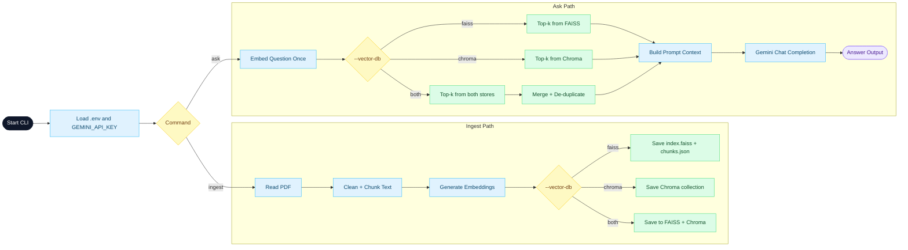

# agentci-ai-rag-with-faiss-and-chroma-db

Simple PDF RAG (Retrieval-Augmented Generation) CLI app with FAISS + ChromaDB.

## What this project does

This project lets you:
1. Ingest a PDF file into vector storage.
2. Ask questions about that PDF.
3. Compare retrieval behavior using `faiss`, `chroma`, or `both`.

It uses:
- `pypdf` for reading PDF text
- `openai` client with Google Gemini OpenAI-compatible endpoint
- `faiss` for local vector search
- `chromadb` for persistent vector search

## What is actual RAG?

RAG means **Retrieval-Augmented Generation**.

It has two parts:
1. Retrieval: find the most relevant chunks from your knowledge base (PDF chunks).
2. Generation: give those chunks to the LLM so it answers using that context.

Without RAG, the model answers only from its general training.  
With RAG, the model answers using your project-specific document data.

### RAG Q&A

1. What is the "knowledge base" here?
- The chunked PDF text stored in FAISS and/or ChromaDB.

2. Why do we create embeddings?
- To convert text into vectors so similarity search can find relevant chunks.

3. Why chunk text?
- Smaller chunks improve retrieval precision and reduce prompt noise.

4. What does `--vector-db both` do?
- It retrieves from FAISS + Chroma, merges results, removes duplicates, then sends final context to the LLM.

5. Where does the final answer come from?
- Gemini model generates the answer, but grounded by retrieved chunk context.

### RAG flow diagram (Q -> A path)

```mermaid
flowchart TD
    Q[User Question] --> QE[Question Embedding]
    QE --> R{Retrieve from DB}
    R -->|faiss| RF[Top-k chunks from FAISS]
    R -->|chroma| RC[Top-k chunks from Chroma]
    R -->|both| RB[Top-k from FAISS + Chroma]
    RB --> M[Merge + De-duplicate]
    RF --> C[Build Context Block]
    RC --> C
    M --> C
    C --> P[Prompt = Context + Question]
    P --> L[Gemini LLM Generation]
    L --> A[Grounded Answer]
```



## Prerequisites

1. Python `3.14+` (as defined in `pyproject.toml`)
2. A valid Gemini API key

## Setup

### 1. Clone repo

```bash
git clone https://github.com/gopal-py07/agentci-ai-rag-with-faiss-and-chroma-db.git
cd agentci-ai-rag-with-faiss-and-chroma-db
```

### 2. Install dependencies

Using `uv`:

```bash
uv sync
```

Or using `pip`:

```bash
pip install -e .
```

### 3. Create local `.env`

```env
GEMINI_API_KEY=your_api_key_here
```

## How to run

### Step 1: Ingest a PDF

Recommended:

```bash
python main.py ingest --pdf "path/to/your-file.pdf" --vector-db both
```

Vector DB options:

```bash
python main.py ingest --pdf "path/to/your-file.pdf" --vector-db faiss
python main.py ingest --pdf "path/to/your-file.pdf" --vector-db chroma
python main.py ingest --pdf "path/to/your-file.pdf" --vector-db both
```

This creates/updates:
- `rag_store/index.faiss` (FAISS index)
- `rag_store/chunks.json` (chunk text for FAISS)
- `rag_store/chroma/` (ChromaDB persistent store)

### Step 2: Ask a question

Recommended:

```bash
python main.py ask "What is this PDF about?" --vector-db both
```

Examples:

```bash
python main.py ask "What is this PDF about?" --k 5 --vector-db faiss
python main.py ask "What is this PDF about?" --k 5 --vector-db chroma
python main.py ask "What is this PDF about?" --k 5 --vector-db both
```

- `--k` controls top matching chunks.
- `--vector-db` selects retrieval source (`faiss`, `chroma`, `both`).

## Flow diagram



## Flow explanation

1. Startup
- App starts from `main.py`.
- It reads local `.env` and loads `GEMINI_API_KEY`.

2. Ingest path (`ingest`)
- Extract text from PDF using `pypdf`.
- Clean and split text into chunks.
- Generate embeddings for chunks.
- Save vectors based on `--vector-db`:
  - `faiss`: saves `index.faiss` + `chunks.json`
  - `chroma`: saves Chroma persistent collection
  - `both`: saves to both stores

3. Ask path (`ask`)
- Embed the user question one time.
- Retrieve top-k matches from selected store(s).
- If `both`, combine both result lists and remove duplicates.
- Build context prompt from retrieved chunks.
- Send prompt to Gemini model and print final response.

## Project structure

```text
.
|-- main.py
|-- pyproject.toml
|-- uv.lock
`-- rag_store/
    |-- chunks.json
    |-- index.faiss
    `-- chroma/
```

## Common errors

1. `Please set the GEMINI_API_KEY environment variable.`
- Set env var before running commands.

2. `RAG store not found. Run ingest first.`
- Run `ingest` before `ask`.

3. `No text could be extracted from this PDF.`
- PDF may be scanned/image-only or empty text layer.
